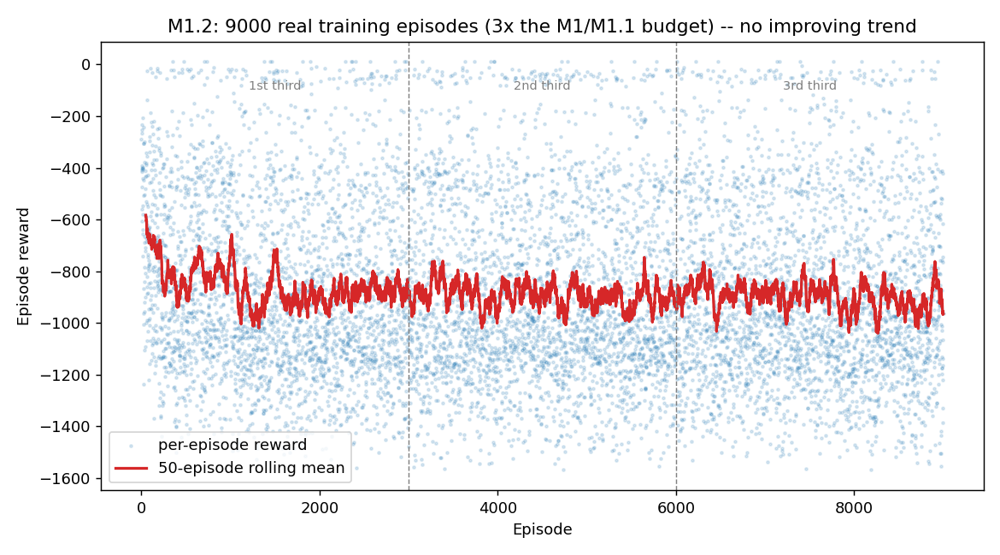
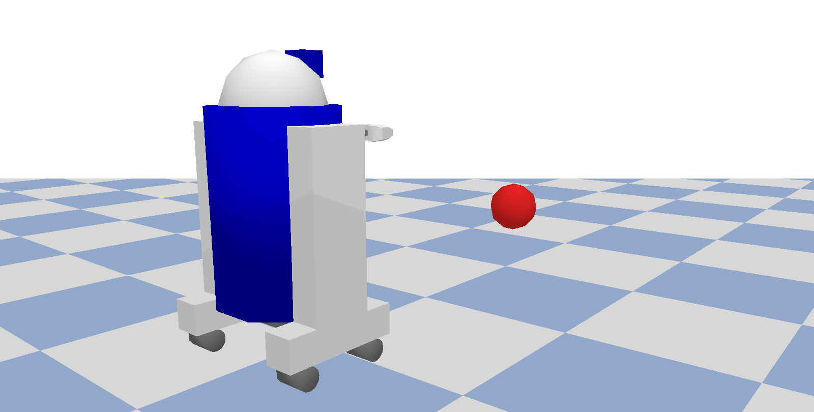

# PPO Robot Controller

[](https://github.com/andrealo20/ppo-robot-controller/actions/workflows/ci.yml)
[](LICENSE)
[](requirements.txt)
[-red.svg)](tests/)
[](docs/design.md)

**A from-scratch PPO implementation (PyTorch, no RL library) for a PyBullet
reaching task, with a hand-derived GAE bootstrap tested against an
independent reference and a mutation check, multi-episode rollout collection
with minibatched updates, and a workspace bound verified by sabotage.**

## Status

**Update, M1.3 (in progress):** an independent review of this repository
found two real problems the three disproved hypotheses below never could:
(1) `select_action()` computes the PPO log-probability on the raw sampled
action but stores and later re-scores the *clipped* one -- confirmed by a
new test that measures the PPO ratio before any gradient step and finds it
should be 1.0 but reaches values up to 473 when std is at the trained
ceiling; (2) the reaching target is a normal dynamic rigid body, not a
fixed marker, and the kinematically-overridden robot can physically shove it
out of reach on contact -- confirmed by a new hand-coded oracle-controller
test that fails 5/100 seeds for exactly this reason, and shows target drift
of up to 0.7m even in episodes that do succeed. The public GitHub `main`
branch was also found to never have actually received the M1/M1.1/M1.2
source changes (only the documentation did) -- being corrected alongside
this update. See `docs/design.md`, "M1.3", for the full trace and numbers.
Neither problem is fixed yet; no conclusions below account for them.

Honestly not converged, across seven separate real training runs. Multi-episode
rollouts, minibatching, and a hard workspace bound are all implemented and
tested; training runs stably end to end; real training curves and real
held-out evaluations exist throughout. None of it has produced an agent that
reliably reaches the target: **2-8% success rate depending on the run, no
improving trend in any of them — including a run 3x longer than the rest,
run specifically to test whether more training was the missing piece.**
`docs/design.md` records the full story, including three specific, testable
hypotheses for the plateau (a saturated policy noise parameter, then an
unbounded workspace, then too small a training budget) that were each tested
against real curves and disproved — a targeted fix for each of the first two
was tried and made things measurably *worse*, and the third (running 3x
longer) simply produced a flat curve, not a rising one. What is left
untested is a much larger budget still (roughly another order of magnitude),
or a limitation none of these three hypotheses targeted at all: reward
shaping, network capacity, or the action scale relative to the workspace.

## Milestones

- **M0 — plumbing correct, tested, documented.** Fixed a broken import that
  prevented the agent from being constructed at all, a module-invocation bug
  that broke the documented entry point independently of that, a bug that
  bootstrapped every truncated episode as if it had terminated (see
  `docs/design.md` for the derivation and the test that pins it down), and
  an observation-shape mismatch (7 values returned against a declared 6)
  that only the test suite caught. Added observation normalization, a clamp
  on the policy's log standard deviation, and 21 tests.
- **M1 — multi-episode rollouts, minibatching, real training runs.**
  Replaced the single-episode/full-batch update with a configurable rollout
  buffer spanning multiple episodes (motivated by a real, documented
  900-episode M0 run that showed no learning at all), with GAE correctly cut
  at every episode boundary inside the buffer — pinned down by a dedicated
  leak test, verified by sabotage. Found and fixed a real reward-accounting
  bug in the rollout loop along the way (also test-caught, not
  code-review-caught). Four real training runs later: one stable
  configuration found, still not learning past a flat reward plateau; two
  disproved hyperparameter fixes, disclosed rather than hidden.
- **M1.1 — bound the workspace, verified by sabotage; the plateau
  hypothesis it tested, disproved.** Added a hard clamp on the robot's
  planar position (`WORKSPACE_LIMIT`), a real, kept fix for the
  unbounded-runaway failure mode M1's collapsed runs hit. A full training run
  with it tracked the unbounded run's flat plateau almost exactly, then got
  *worse* in the final third — disproving the hypothesis that workspace
  bounding was the plateau's cause. 29 tests total.
- **M1.2 — test the training-budget hypothesis at 3x the budget,
  disproved too (this milestone).** A full 9000-episode run (~4.37M
  environment steps, 3x M1/M1.1's budget), otherwise identical to M1.1, was
  split into thirds and fit with a trend line: mean reward and success rate
  both came back flat-to-slightly-declining across the whole run, not
  improving. The held-out success rate ticked up (2% → 6% → 8% across the
  three runs) but that movement is within sampling noise at n=50 and does
  not track the (larger, more reliable) training-curve trend, which shows no
  improvement. A much larger budget (another order of magnitude) remains
  untested and unruled-out.

## How it works

`RobotReachEnv` (PyBullet, Gymnasium API) rewards the negative planar
distance to a random target, with a bonus for reaching it. The "robot" is a
fixed-base `r2d2.urdf` mesh whose base position/velocity is set directly
rather than driven by joint torques or forces — see Limitations below for
what that does and doesn't mean for any results trained on it.

`PPOAgent` implements PPO from the ground up: a shared-trunk actor-critic
network (`PolicyValueNetwork`), clipped surrogate policy loss, GAE advantage
estimation, and entropy regularization. Updates run over a rollout buffer
that can span several episodes (`--rollout-steps`, default 2048), shuffled
into minibatches (`--minibatch-size`) across `--ppo-epochs` epochs. No RL
library (Stable-Baselines3, RLlib, ...) is used for the algorithm itself —
only PyTorch, Gymnasium (for the environment API) and PyBullet (for the
physics).

<p align="center">
  
</p>

<p align="center"><sub>9000 real episodes, not a typo: three times the
budget of every earlier run, run specifically to test whether more training
was the missing ingredient. It wasn't — the curve is flat, not rising. See
<a href="docs/design.md">docs/design.md</a> for the full story, including
the M1 vs M1.1 comparison and the two earlier runs that collapsed into
runaway trajectories instead of plateauing.</sub></p>

<p align="center">
  
</p>

<p align="center"><sub>PyBullet render of a real reset of <code>RobotReachEnv</code>.
The target is drawn as an enlarged red marker for visibility — the actual
<code>sphere_small.urdf</code> collision/visual target is a few millimetres
across at this scale and would not read as a dot in a screenshot.</sub></p>

## Installation

```sh
git clone https://github.com/andrealo20/ppo-robot-controller.git
cd ppo-robot-controller
pip install -r requirements.txt
```

## Quick start

Run everything as a module, from the repository root — see `docs/design.md`
for why `python src/train.py` (the natural-looking command) does not work.
The hyperparameters below are the actual M1 run's (see `docs/design.md` for
why these specific values, and which ones were tried and rejected):

```sh
python -m src.train --num-episodes 3000 --lr 1e-4 --rollout-steps 2048 --minibatch-size 64
python -m src.evaluate --model-path experiments/checkpoints/best_model.pt --episodes 50 --seed 1000
python -m pytest tests -q
```

## Repository layout

```
src/
├── environment/    reaching_env.py — the PyBullet/Gymnasium environment
├── agent/          ppo.py — the PPO agent (multi-episode rollout buffer, GAE, minibatched clipped update)
├── network/        policy_value.py — shared-trunk actor-critic network
├── utils/          running_normalizer.py — running observation normalization
├── train.py        training entry point + collect_rollout (python -m src.train)
└── evaluate.py      evaluation entry point (python -m src.evaluate)

tests/              29 tests: GAE reference + multi-episode leak + mutation
                    checks, rollout collection bookkeeping, network clamp,
                    agent smoke tests, environment terminated/truncated
                    contract + workspace bound, running normalizer
docs/design.md      what was found, what was fixed, what was tried and
                    reverted, and why — including all seven M1/M1.1/M1.2
                    training runs
conftest.py         empty; exists only so pytest puts the repo root on
                    sys.path (see docs/design.md)
experiments/        checkpoints and TensorBoard logs land here at runtime
assets/             reaching_env.png, training_reward_m1.png,
                    training_reward_m1_1_comparison.png,
                    training_reward_m1_2.png — real renders and real
                    training data, not mockups (see docs/design.md)
```

## Limitations

Stated here rather than left to be discovered.

- **The agent does not reliably solve the task yet.** 2-8% success rate
  across seven real training runs, no improving trend in any of them —
  including a run 3x longer than the rest. See `docs/design.md` for the full
  story, including three tested-and-disproved hypotheses and what is left
  untested (a much larger training budget, or a non-budget explanation).
- **The reaching task is kinematic, not dynamic.** The robot's base
  position/velocity is set directly each step; gravity and rigid-body
  dynamics play no role. This is a 2D point-reaching problem with a robot
  mesh on top, not a locomotion or manipulation task — nothing here should
  be read as evidence about either.
- **No parallel environments.** Rollouts are collected from a single
  environment instance, serially.
- **Training runs are not seeded.** `python -m src.train` does not accept a
  `--seed` (network init and environment randomness both vary freely between
  runs); only `python -m src.evaluate` does. This is a real source of the
  run-to-run spread visible in `docs/design.md`'s numbers (e.g. M1.2's first
  3000 episodes averaging noticeably worse than M1.1's, despite identical
  hyperparameters) and is worth fixing before comparing any future run
  against these ones too closely.

## References

- [PPO paper (Schulman et al., 2017)](https://arxiv.org/abs/1707.06347)
- [Generalized Advantage Estimation (Schulman et al., 2016)](https://arxiv.org/abs/1506.02438)
- [PyBullet docs](https://pybullet.org/)
- [Gymnasium](https://gymnasium.farama.org/)

## Licence

MIT — see [LICENSE](LICENSE).
