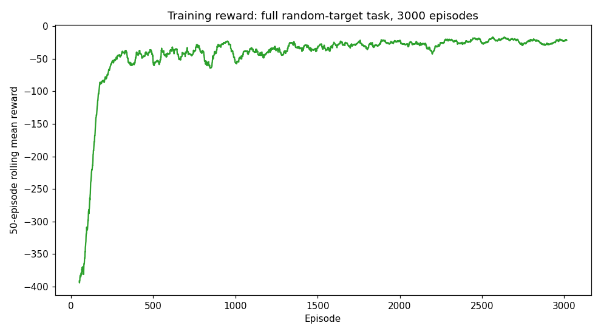
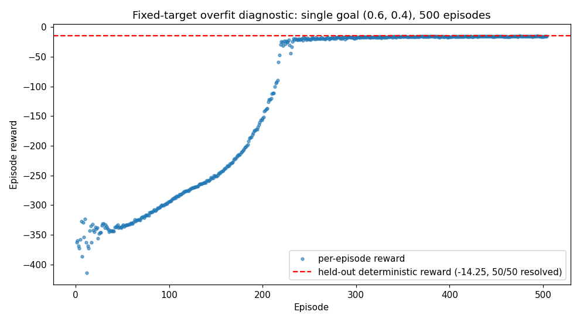

# PPO Robot Controller

[](https://github.com/andrealo20/ppo-robot-controller/actions/workflows/ci.yml)
[](LICENSE)
[](requirements.txt)
[](tests/)
[](docs/design.md)

**A from-scratch PPO implementation (PyTorch, no RL library) for a PyBullet
reaching task, with a hand-derived GAE bootstrap tested against an
independent reference, a tanh-squashed Gaussian policy verified against the
PPO ratio identity, multi-episode rollout collection with minibatched
updates, and a workspace bound verified by sabotage.**

## Result

On the full random-target task (target sampled uniformly from
`[-1, 1] x [-1, 1]` each episode), a held-out evaluation of the trained
policy (deterministic actions, frozen observation-normalizer statistics,
50 episodes, seed 1000) resolves **42/50 episodes (84%)**, mean reward
-49.70 +/- 74.13. The variance is driven by two hard episodes (likely far
corner targets); the other 48 cluster between roughly -40 and +7.

The training curve backs this up: chunked into ten 300-episode blocks, mean
reward climbs from -172 in the first block to a stable -20 to -30 range by
the back half of the run, with success rate rising alongside it. A linear
fit over the ten chunks gives a positive slope (`r=0.649`).

<p align="center">
  
</p>

<p align="center"><sub>Real training run, full random-target task, 3000
episodes. See <a href="docs/design.md">docs/design.md</a> for the full
numbers.</sub></p>

<p align="center">
  
</p>

<p align="center"><sub>PyBullet render of a real reset of <code>RobotReachEnv</code>.
The target is drawn as an enlarged red marker for visibility — the actual
<code>sphere_small.urdf</code> collision/visual target is a few millimetres
across at this scale and would not read as a dot in a screenshot.</sub></p>

## How it works

`RobotReachEnv` (PyBullet, Gymnasium API) rewards the negative planar
distance to a random target, with a bonus for reaching it. The "robot" is a
fixed-base `r2d2.urdf` mesh whose base position/velocity is set directly
rather than driven by joint torques or forces — see Limitations below for
what that does and doesn't mean for the results. The target is a
fixed-base body too, so it is a static landmark rather than something the
robot can physically shove out of place. The robot's planar position is
clamped to a fixed workspace bound so that a bad policy's reward is capped
rather than growing unboundedly worse the longer it drifts.

`PPOAgent` implements PPO from the ground up: a shared-trunk actor-critic
network (`PolicyValueNetwork`), a tanh-squashed diagonal Gaussian policy,
clipped surrogate policy loss, GAE advantage estimation, and entropy
regularization. Sampling, squashing into the environment's action bounds,
and log-probability scoring (including the change-of-variables Jacobian
correction) are computed consistently for the exact action returned to the
caller, so the PPO importance ratio `exp(log_pi_new(a) - log_pi_old(a))` is
provably 1.0 for every stored transition before any optimizer step — checked
directly by a dedicated test, including near-saturated action bounds where a
naive implementation would disagree.

Updates run over a rollout buffer that can span several episodes
(`--rollout-steps`, default 2048), shuffled into minibatches
(`--minibatch-size`) across `--ppo-epochs` epochs; the GAE recursion is cut
at every episode boundary inside the buffer so one episode's advantage never
leaks into another's. Checkpoints save network weights, optimizer state,
configuration, training progress, and observation-normalizer statistics
together, so evaluation can restore and freeze the exact statistics used
during training; evaluation is deterministic by default (`--stochastic` is
explicit). No RL library (Stable-Baselines3, RLlib, ...) is used for the
algorithm itself — only PyTorch, Gymnasium (for the environment API), and
PyBullet (for the physics).

Before spending a full training budget on the random-target task, a cheap
fixed-target overfit diagnostic (one static goal, a few hundred episodes)
is a useful sanity check that the whole pipeline can learn at all: on this
implementation it converges cleanly, reward climbing from around -350 to
around -15 over the first ~230 of 500 episodes, and a held-out evaluation on
that fixed goal resolves 50/50.

<p align="center">
  
</p>

<p align="center"><sub>The cheaper diagnostic run: a single fixed goal, 500
episodes, 50/50 held-out at convergence.</sub></p>

## Installation

```sh
git clone https://github.com/andrealo20/ppo-robot-controller.git
cd ppo-robot-controller
pip install -r requirements.txt
```

## Quick start

Run everything as a module, from the repository root (`python src/train.py`
does not work — running a script directly puts `src/` itself on `sys.path`,
not the repository root, so `from src.x import y` has nothing to resolve
against):

```sh
python -m src.train --num-episodes 3000 --lr 1e-4 --rollout-steps 2048 --minibatch-size 64
python -m src.evaluate --model-path experiments/checkpoints/best_model.pt --episodes 50 --seed 1000
python -m pytest tests -q

# Cheap overfit diagnostic on one fixed goal before a full run
python -m src.train --num-episodes 500 --fixed-target 0.6 0.4 --output-dir experiments/fixed_target
```

## Repository layout

```
src/
├── environment/    reaching_env.py — the PyBullet/Gymnasium environment
├── agent/          ppo.py — the PPO agent (tanh-squashed Gaussian policy, multi-episode rollout buffer, GAE, minibatched clipped update)
├── network/        policy_value.py — shared-trunk actor-critic network
├── utils/          running_normalizer.py — running observation normalization
├── train.py        training entry point + collect_rollout (python -m src.train)
└── evaluate.py      evaluation entry point (python -m src.evaluate)

tests/              39 tests: GAE reference + multi-episode leak + sabotage
                    checks, PPO ratio-identity invariant, rollout collection
                    bookkeeping, network initialization, agent smoke tests,
                    environment terminated/truncated contract + workspace
                    bound, a hand-coded oracle solvability check, running
                    normalizer
docs/design.md      architecture and design rationale
conftest.py         empty; exists only so pytest puts the repo root on
                    sys.path (see docs/design.md)
experiments/        checkpoints and TensorBoard logs land here at runtime
assets/             reaching_env.png, training_reward_fixed_target.png,
                    training_reward_random_target.png — real renders and
                    real training data, not mockups
```

## Limitations

- **The task is not solved outright.** 84% held-out success (42/50, seed
  1000) on one 3000-episode run is a real result, not a guarantee — 16% of
  held-out episodes still fail, no second random-target run has been done to
  check run-to-run variance (training is unseeded, see below), and 3000
  episodes is still a modest budget by continuous-control standards.
- **The reaching task is kinematic, not dynamic.** The robot's base
  position/velocity is set directly each step; gravity and rigid-body
  dynamics play no role. This is a 2D point-reaching problem with a robot
  mesh on top, not a locomotion or manipulation task — nothing here should
  be read as evidence about either.
- **No parallel environments.** Rollouts are collected from a single
  environment instance, serially.
- **Training runs are not seeded.** `python -m src.train` does not accept a
  `--seed` (network init and environment randomness both vary freely between
  runs); only `python -m src.evaluate` does. Run-to-run spread on this task
  is therefore expected and is worth accounting for before comparing any
  future run against this one too closely.

## References

- [PPO paper (Schulman et al., 2017)](https://arxiv.org/abs/1707.06347)
- [Generalized Advantage Estimation (Schulman et al., 2016)](https://arxiv.org/abs/1506.02438)
- [PyBullet docs](https://pybullet.org/)
- [Gymnasium](https://gymnasium.farama.org/)

## Licence

MIT — see [LICENSE](LICENSE).
